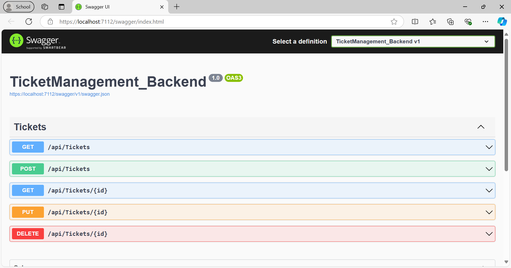
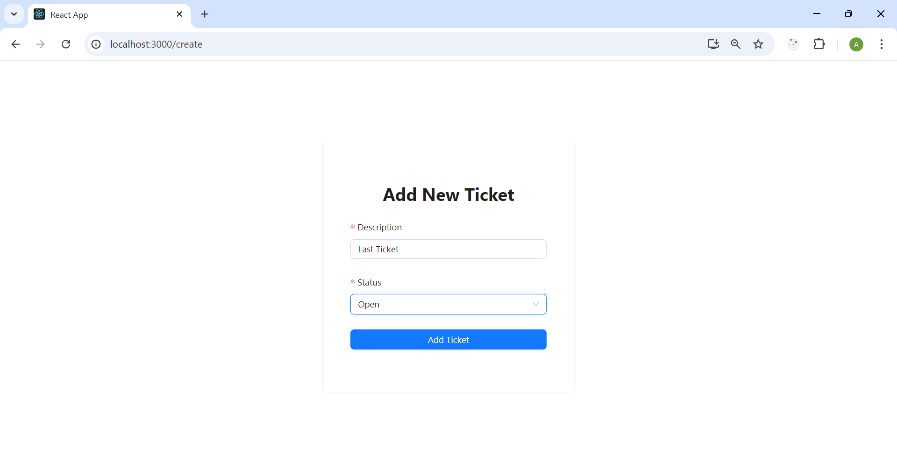
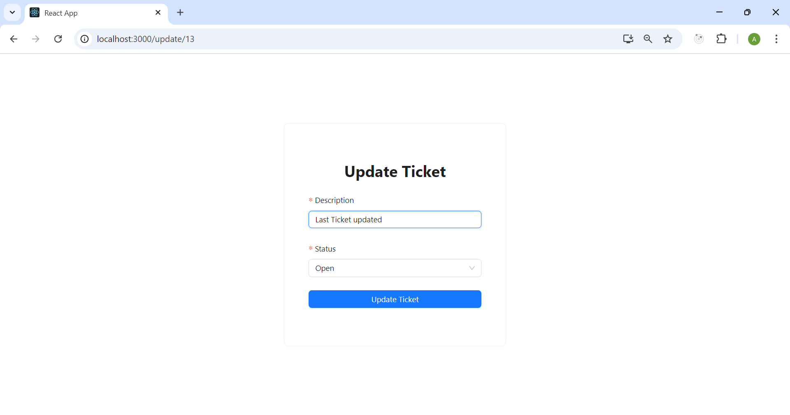
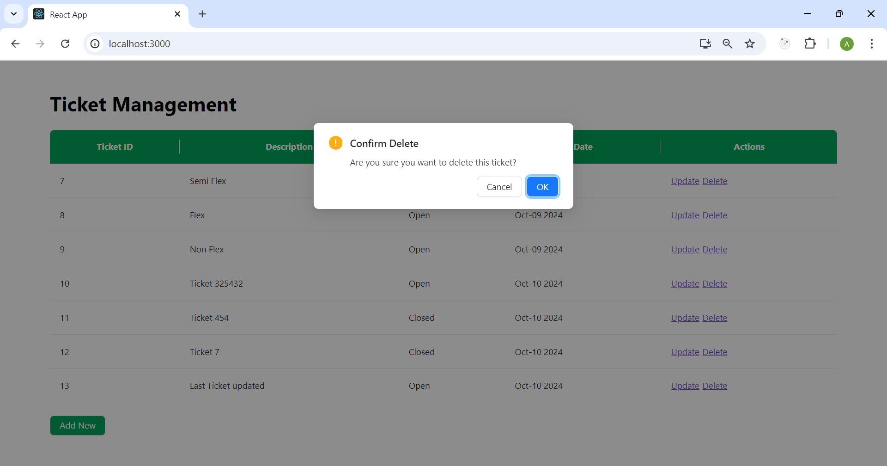
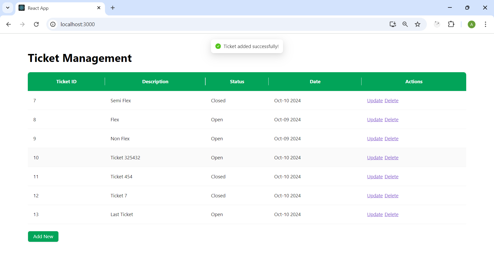
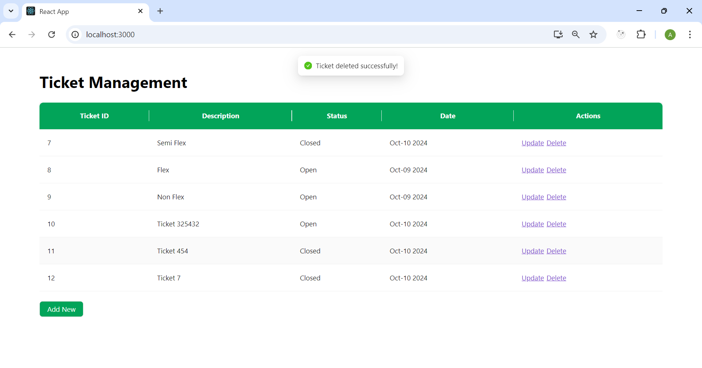

# Ticket Management System

## Introduction

The **Ticket Management System** is a full-stack web application designed to perform basic CRUD operations (Create, Read, Update, Delete) for managing tickets. The system allows users to create, view, update, and delete tickets, along with additional features such as pagination and filtering.

## Technologies

### Backend:

- **.NET 8**: For building the RESTful API.
- **ASP.NET Core Web API**: For handling HTTP requests.
- **Entity Framework Core**: ORM for database interactions.
- **SQL Server**: To store ticket data.

### Frontend:

- **React.js**: For creating the user interface.
- **TypeScript**: Type safety and modern JavaScript features.
- **Ant Design**: For pre-built UI components.
- **Jest**: For frontend unit testing.

## Installation

### Prerequisites:

- Node.js
- .NET 8 SDK
- SQL Server
- Git
- Visual Studio

### Frontend Setup:

1. Clone the repository:
   ```bash
   git clone https://github.com/Ayoub771111/Tickets-Management-Application.git
   ```
2. Navigate to the frontend directory:
   ```bash
   cd ticket-management-system/TicketManagement_Backend/my-app
   ```
3. Install the dependencies:
   ```bash
   npm install
   ```

### Backend Setup:

1. Navigate to the backend directory:
   ```bash
   cd ticket-management-system/TicketManagement_Backend
   ```
2. Install backend dependencies:

   ```bash
   dotnet restore
   ```

3. Update the `appsettings.json` file with your SQL Server connection string:

   ```json
   {
     "ConnectionStrings": {
       "TicketDB": "Server=your_server;Database=TicketDB;User Id=your_username;Password=your_password;"
     }
   }
   ```

4. Run database migrations to create the database:
   ```bash
   dotnet ef database update
   ```

## Setup

### Running the Backend:

1. Open the solution in Visual Studio:

   - Navigate to the project folder and double-click the `.sln` file to open the project in Visual Studio.
   - Alternatively, you can open Visual Studio, select **Open a Project or Solution**, and navigate to the backend folder.

2. Build and run the backend API using Visual Studio:

   - Select **Build** > **Build Solution** from the menu.
   - To run the project, press `F5` or select **Debug** > **Start Debugging**.

   The API should now be running at `https://localhost:7112`.

### Running the Frontend:

1. In the `frontend` directory, start the development server:

   ```bash
   npm start
   ```

   The application should now be accessible at `http://localhost:3000`.

## Usage

1. Once both the backend and frontend servers are running, navigate to `http://localhost:3000` in your browser.
2. You will see a list of existing tickets, with options to add, update, delete.

## Testing

- The frontend tests are written using **Jest**.
- Run the tests with the following command:
  ```bash
  npm test
  ```

## Images

Here's a snapshot of the Ticket Management System UI:

## 1. Swagger Documentation

This image shows the Swagger interface used for testing and visualizing the available API endpoints for the ticket management system.



## 2. All Tickets - Home Page

The main page lists all the tickets along with actions like adding, updating, and deleting tickets.


## 3. Add New Ticket

This is the form where users can create a new ticket by filling out the details such as description, status, and date.



## 4. Update Ticket

Here, users can update an existing ticket by modifying the details.



## 5. Delete Confirmation

A modal popup appears when a user chooses to delete a ticket, asking for confirmation before deletion.



## 6. Message After Adding a Ticket

After successfully adding a new ticket, this message appears confirming the action.



## 7. Message After Updating a Ticket

This message is shown after successfully updating an existing ticket.


## 8. Message After Deleting a Ticket

This message confirms the successful deletion of a ticket.


